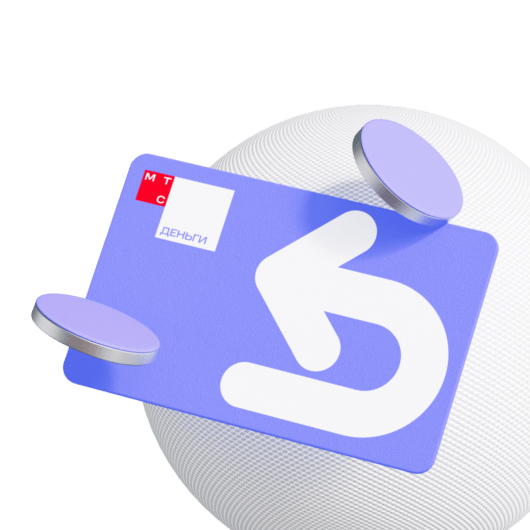
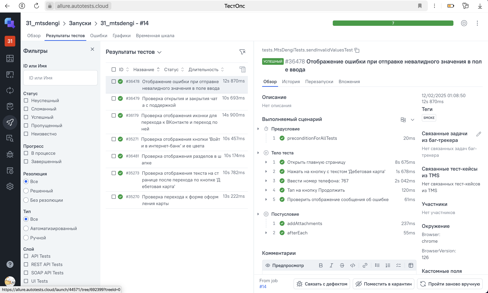
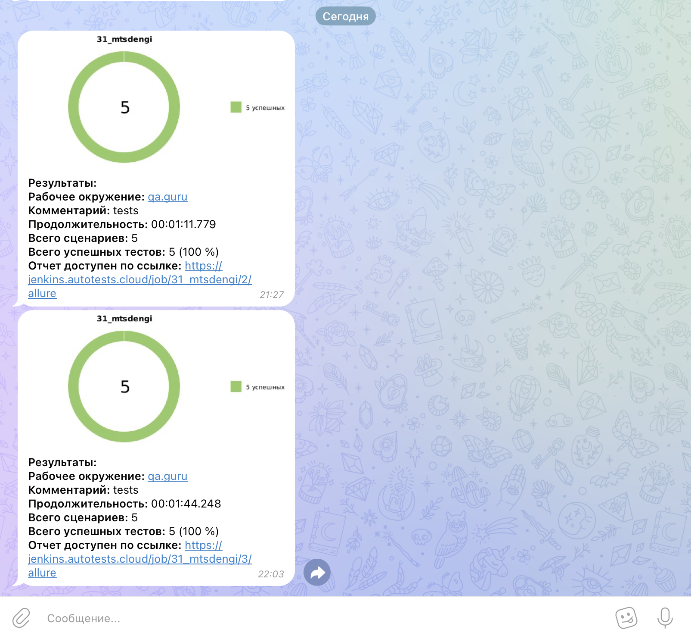

# Проект по автоматизации тестовых сценариев для сайта МТС-Деньги
<p align="center">
<a href="https://ru.wikipedia.org/"></a>
</p>


##  Содержание:
- <a href="#cases"> Тест-кейсы</a>
- <a href="#autotests"> Запуск автотестов</a>
- <a href="#jenkins"> Сборка в Jenkins</a>
- <a href="#allureReport"> Пример Allure-отчета</a>
- <a href="#allureReport2"> Пример отчета Allure TestOps</a>
- <a href="#tg"> Уведомления в Telegram с использованием бота</a>
- <a href="#movie">Видеопример прохождения тестов</a>


Тесты написаны на языке <code>Java</code> с использованием фреймворка для автоматизации тестирования <code>[Selenide](https://selenide.org/)</code>, сборщик - <code>Gradle</code>.

<code>JUnit 5</code> задействован в качестве фреймворка модульного тестирования.

____
<a id="cases"></a>
## 🕵️‍♂️ Тест-кейсы
- Отображение ошибки при отправке невалидного значения в поле ввода
- Проверка открытия и закрытия чата с поддержкой
- Проверка отображения иконки для перехода к ВКонтакте и переход по ней
- Проверка отображения кнопки 'Войти в интернет-банк' и ее цвета
- Проверка отображения разделов в шапке
- Проверка отображения текста на странице после перехода по кнопке 'Дебетовая карта'
- Проверка перехода к форме оформления карты


____
<a id="autotests"></a>
## ▶️ Команда для запуска автотестов из терминала


```bash 
gradle clean simple_test
```

---
<a id="jenkins"></a>
##  </a> Сборка в <a target="_blank" href="https://jenkins.autotests.cloud/job/31_mtsdengi/"> Jenkins </a>
Для доступа в Jenkins необходима регистрация на ресурсе [Jenkins](https://jenkins.autotests.cloud/)
Для запуска сборки необходимо нажать кнопку <code>Build now</code>.
<p align="center">

</p>
После выполнения сборки, в блоке <code>Build History</code> напротив номера сборки появятся значки 
<code>Allure Report</code>, при клике на которые откроется страница с сформированным html-отчетом.

____
<a id="allureReport"></a>
##  </a> Пример <a target="_blank" href="https://jenkins.autotests.cloud/job/c31_vmnqa_mobile_tests_wiki/56/allure/"> Allure-отчета </a>
<p align="center">

</p>

____
<a id="allureReport2"></a>
##  </a> Пример <a target="_blank" href="https://allure.autotests.cloud/launch/44571"> отчета Allure TestOps</a>
<p align="center">

</p>

____
<a id="tg"></a>
##  Уведомления в Telegram с использованием бота
После завершения сборки, бот, созданный в <code>Telegram</code>, автоматически обрабатывает и отправляет сообщение с отчетом
о прогоне тестов в чат
<p align="center" style="background-color: #18222d">

</p>

____

## Видео примера запуска тестов в Selenoid

К каждому тесту в отчете прилагается видео прогона.
<p align="center">
  
</p>
