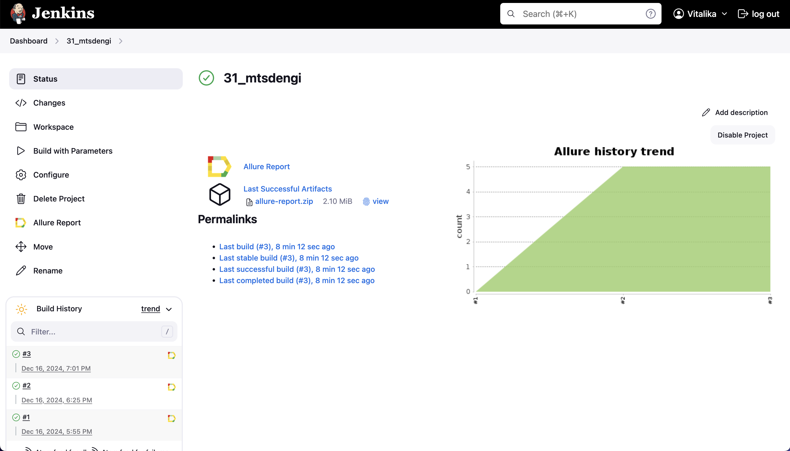

# Проект по автоматизации тестовых сценариев для сайта МТС-Деньги
## :pushpin: Содержание:

- [Использованный стек технологий](#computer-использованный-стек-технологий)
- [Запуск автотестов](#arrow_forward-запуск-автотестов)
- [Сборка в Jenkins](#img-srcmedialogojenkinssvg-titlejenkins-width4-сборка-в-jenkins)
- [Пример Allure-отчета](#img-srcmedialogoallure_reportsvg-titleallure-report-width4-пример-allure-отчета)
- [Уведомления в Telegram с использованием бота](#img-width4-stylevertical-alignmiddle-titletelegram-srcmedialogotelegramsvg-уведомления-в-telegram-с-использованием-бота)
- [Видео примера запуска тестов в Selenoid](#-видео-примера-запуска-теста-в-selenoid)

## :computer: Использованный стек технологий

<p align="center">
<a href="https://www.jetbrains.com/idea/"></a>
<a href="https://www.java.com/"></a>
<a href="https://selenide.org/"></a>  
<a href="https://aerokube.com/selenoid/"></a> 
<a href="ht[images](images)tps://github.com/allure-framework/allure2"></a>
<a href="https://qameta.io/"></a>  
<a href="https://gradle.org/"></a> 
<a href="https://junit.org/junit5/"></a>   
<a href="https://github.com/"></a>   
<a href="https://www.jenkins.io/"></a>   
<a href="https://web.telegram.org/k//"></a>
<a href="https://www.atlassian.com/ru/software/jira/"></a>
</p>

- В данном проекте автотесты написаны на языке <code>Java</code> с использованием фреймворка для тестирования Selenide. 
- В качестве сборщика был использован - <code>Gradle</code>.  
- Использованы фреймворки <code>JUnit 5</code> и [Selenide](https://selenide.org/).
- При прогоне тестов браузер запускается в [Selenoid](https://aerokube.com/selenoid/).
- Для удаленного запуска реализована джоба в <code>Jenkins</code> с формированием Allure-отчета и отправкой результатов в <code>Telegram</code> при помощи бота. 
- Осуществлена интеграция с <code>Allure TestOps</code> и <code>Jira</code>

Содержание Allure-отчета:
* Шаги теста;
* Скриншот страницы на последнем шаге;
* Page Source;
* Логи браузерной консоли;
* Видео выполнения автотеста.

## :arrow_forward: Запуск автотестов

### Запуск тестов из терминала
```
gradle clean simple_test
```
При выполнении команды, данные тесты запустятся удаленно в <code>Selenoid</code>.

```
clean
simple_test
-DremoteUrl=https://${REMOTE_LOGIN}:${REMOTE_PASSWORD}@${REMOTE_URL}/wd/hub
-DbrowserName=${BROWSER}
-DbrowserVersion=${BROWSER_VERSION}
-DbrowserSize=${BROWSER_SIZE}
```

### Параметры сборки

* <code>BROWSER_NAME</code> – браузер, в котором будут выполняться тесты. По-умолчанию - <code>chrome</code>.
* <code>BROWSER_VERSION</code> – версия браузера, в которой будут выполняться тесты. По-умолчанию - <code>100.0</code>.
* <code>BROWSER_SIZE</code> – размер окна браузера, в котором будут выполняться тесты.
* <code>BASE_URL</code> – Url, по которому будет открываться тестируемое приложение.
* <code>REMOTE_BROWSER_URL</code> – адрес удаленного сервера, на котором будут запускаться тесты.

##  Сборка в Jenkins
<p align="center">

</p>

##  Пример Allure-отчета
### Overview

<p align="center">

</p>

### Результат выполнения теста

<p align="center">

</p>

##  Интеграция с Allure TestOps

Выполнена интеграция сборки <code>Jenkins</code> с <code>Allure TestOps</code>.
Результат выполнения автотестов отображается в <code>Allure TestOps</code>
На Dashboard в <code>Allure TestOps</code> отображена статистика пройденных тестов.

<p align="center">

</p>


##  Уведомления в Telegram с использованием бота

После завершения сборки, бот созданный в <code>Telegram</code>, автоматически обрабатывает и отправляет сообщение с результатом.

<p align="center">

</p>

## Видео примера запуска тестов в Selenoid

К каждому тесту в отчете прилагается видео прогона.
<p align="center">
  
</p>
